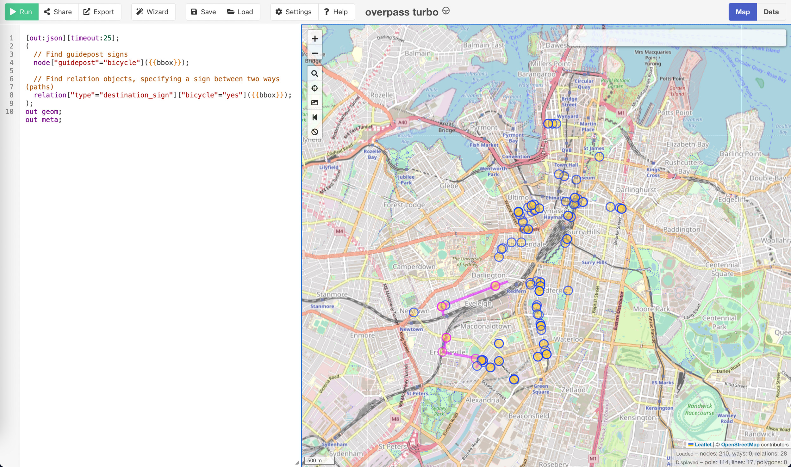
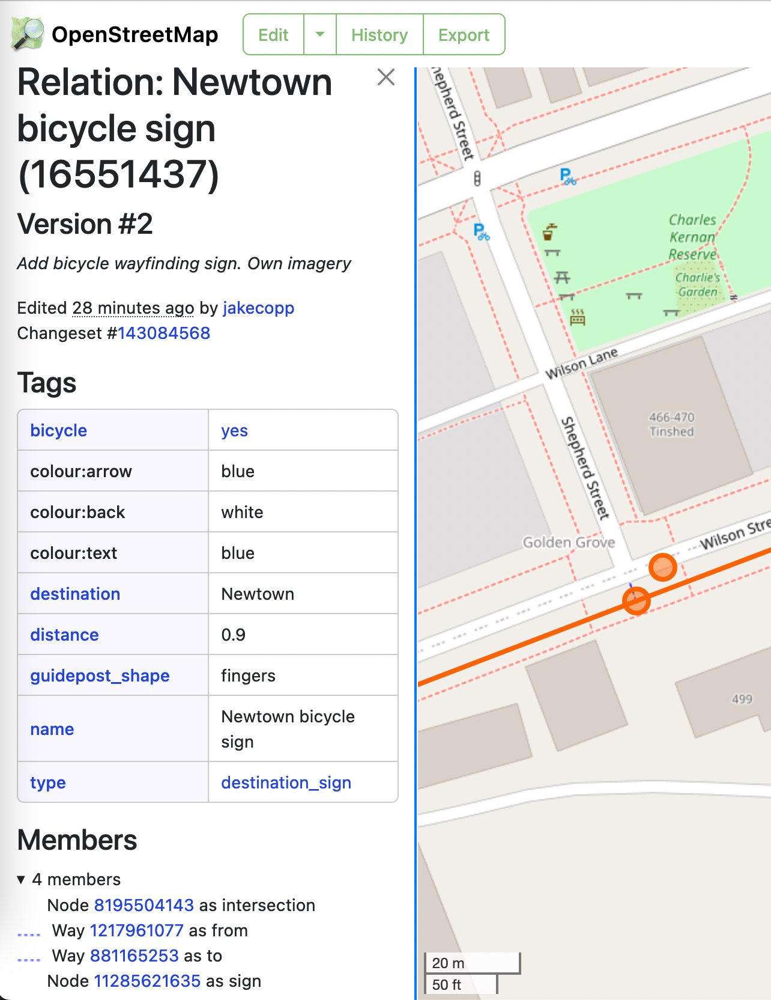
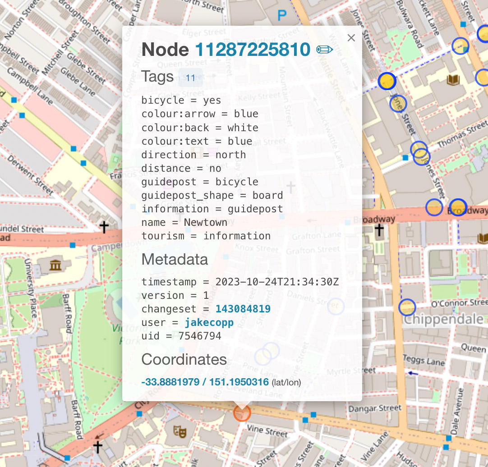

Bicycle signage in Sydney map - blog post draft
===============================================



Map link: <a href="https://overpass-turbo.eu/s/1CpV">https://overpass-turbo.eu/s/1CpV</a>

- This page is a work in progress
- There currently isn't any public datasets on bicycle wayfinding infrastructure in Sydney
- OpenStreetMap provides an easy method of crowdsourcing a high quality dataset and allows
  for public analysis
- I've started surveying wayfinding signage in the City of Sydney
- It's incomplete, but I hope this resource helps others with the correct tagging




# Overpass Turbo query

```
[out:json][timeout:25];
(
  // Find guidepost signs
  node["guidepost"="bicycle"]({{bbox}});
  
  // Find relation objects, specifying a sign between two ways (paths)
  relation["type"="destination_sign"]["bicycle"="yes"]({{bbox}});
);
out geom;
out meta;
```

# Tagging

For individual signs, use `information=guidepost` with the below tags.
For multiple signs on the same pole, use the `destination_sign` relation.
See https://en.wikipedia.org/wiki/Destination_sign for further syntax.
There is also further discussion at
https://wiki.openstreetmap.org/wiki/Talk:Key:guidepost_shape.

## Guidepost syntax
### Example board sign
```
bicycle=yes
colour:arrow=blue
colour:back=white
colour:text=blue
direction=north
distance=no
guidepost=bicycle
guidepost_shape=board
information=guidepost
name=Newtown
tourism=information

```

### Example finger sign
```
bicycle=yes
colour:arrow=blue
colour:back=white
colour:text=blue
direction=north
distance=no
guidepost=bicycle
guidepost_shape=fingers
information=guidepost
name=Newtown
tourism=information
```

## Destination sign syntax

```
bicycle=yes
colour:arrow=blue
colour:back=white
colour:text=blue
destination=Green Square;Randwick / UNSW
distance=no
guidepost_shape=fingers
name=Green Square;Randwick / UNSW
type=destination_sign
destination:symbol=bicycle
```